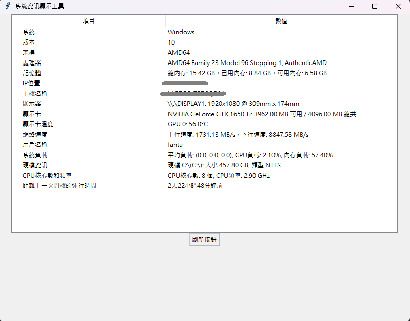

# 系統資訊顯示工具

這個程式是一個用於顯示系統資訊的實用工具，通過運行程式，您可以輕鬆地獲取有關您的電腦系統的各種詳細信息。程式以視覺化的方式呈現系統資訊，使您能夠迅速了解您的電腦的狀態和性能。

## 功能特點

- 系統基本信息，如操作系統名稱、版本和架構。
- 處理器信息，包括處理器型號和核心數，還有當前的頻率。
- 記憶體使用情況，顯示總內存、已用內存和可用內存。
- 顯示器資訊，列出所有連接的顯示器的名稱、分辨率和實際尺寸。
- 顯示卡資訊，包括顯示卡名稱、可用記憶體和總共記憶體。
- 硬碟資訊，顯示所有硬碟的名稱、大小和類型。
- 網絡速度，顯示上行和下行的網絡速度。
- 系統負載，包括平均負載、CPU負載和內存負載。
- 用戶名稱，列出當前登入系統的所有用戶名稱。
- 運行時間，顯示距離上一次開機已運行的天數、小時和分鐘。

## 使用方法

1. 下載程式源碼或執行檔。
2. 運行程式，您將會看到主界面，其中包含 "系統資訊顯示工具" 的標題。
3. 點擊 "刷新按鈕" 以獲取最新的系統資訊。
4. 查看不同項目的詳細數值，從而深入了解您的電腦系統。

## 範例演示

## 開發環境

- 所需程式語言：Python
- 所需導入模組：tkinter、GPUtil、psutil、socket、datetime、screeninfo

## 授權訊息

這個程式遵循 [MIT 授權](LICENSE.txt)，您可以自由地使用、修改和分發這個程式。